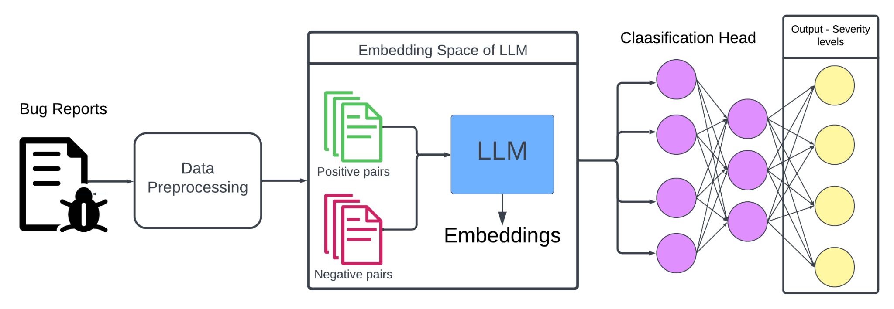
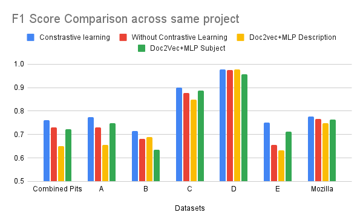
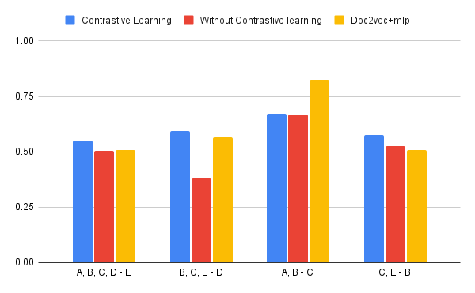
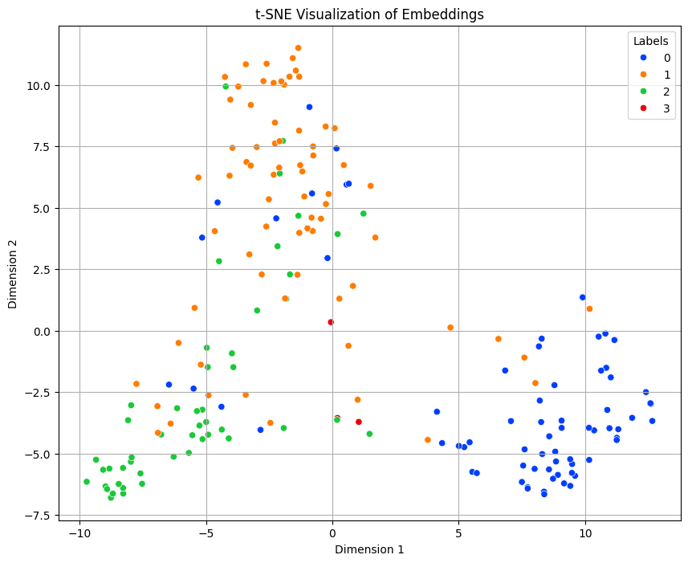
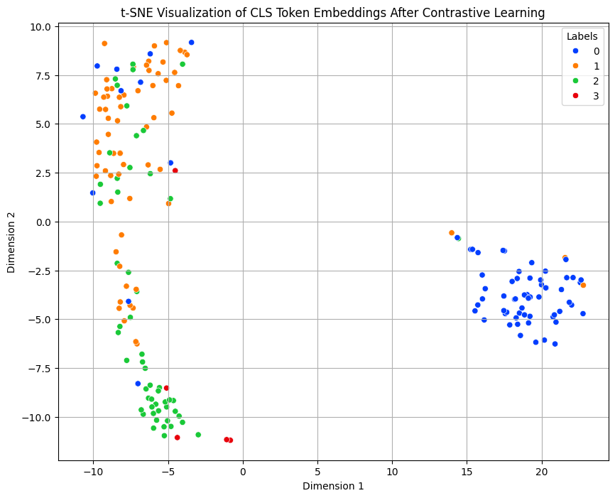

# A Contrastive Learning Approach to Bug Severity Classification with Large Language Model Embeddings

---

## Executive Summary

Every incoming bug report has to be triaged by severity so engineering teams fix the most damaging issues first. Done manually, triage is slow, subjective, and inconsistent and it gets worse as report volume grows and teams change. Mislabeled severity means critical bugs sit in the backlog while minor ones jump the queue.

**The solution.** We automate severity triage by fine-tuning a pre-trained **CodeBERT** language model with **contrastive learning**. The model learns to pull same-severity reports together and push different-severity reports apart in embedding space, producing representations that classify accurately *and* transfer to projects the model has never seen.

**The number impact.**
- **Best-in-class on every same-project dataset** — contrastive learning topped all baselines, reaching **F1 ≈ 0.98** on PITS D and **≈ 0.90** on PITS C.
- **~56% relative F1 gain on the hardest cross-project test** — on the highly imbalanced B, C, E → D split, contrastive learning scored **0.59 vs. 0.38** for the non-contrastive model.
- **Robust where it counts** — it beat both the non-contrastive model and the Doc2Vec baseline on the most diverse, imbalanced cross-project cases, the exact scenarios where naive models fail (accuracy < 0.50).

---

## Problem Statement

Bug severity measures how badly a defect affects functionality, performance, or user experience. Teams use it to **prioritize fixes by criticality** but assigning it by hand doesn't scale.

Existing automated approaches fall short: traditional ML (Naive Bayes, KNN) leans on hand-built keyword dictionaries, and static word embeddings (Word2Vec, GloVe) assign one vector per word regardless of context. Both struggle with the long, unstructured, imbalanced text found in real bug reports and neither generalizes well across different projects.

---

## Methodology

The model runs in two stages. First, **contrastive fine-tuning**: reports are cleaned, tokenized, and formed into positive/negative pairs; CodeBERT encodes each pair, and an **NT-Xent contrastive loss** on the cosine similarity of the two embeddings updates the weights via backpropagation. Second, **classification**: a single report is encoded and passed through a dense layer that predicts its severity.

   
  <em>Fig 1: End-to-end pipeline: pairing → contrastive fine-tuning → classification head.</em>

### Model Architecture

| Component            | Detail                                       |
| -------------------- | -------------------------------------------- |
| Backbone             | CodeBERT (RoBERTa-based)                      |
| Input length         | 256 tokens                                   |
| Embedding dimension  | 768                                          |
| Contrastive loss     | NT-Xent, temperature = 0.5                   |
| Classification head  | Fully connected (768 → num classes)          |
| Loss / Optimizer     | Cross-Entropy / Adam (lr = 2e-5)             |

### Experimental Settings

We evaluate the following:

- **LLM + Contrastive Learning** (ours)
- **LLM without Contrastive Learning**
- **Doc2Vec + MLP** (baseline from prior work)

Key metrics include **Accuracy** and **F1-score**, especially relevant for imbalanced datasets.

**Datasets:** PITS projects A–E, Combined PITS, and Mozilla (80/20 train–test). The Doc2Vec + MLP baseline is trained separately on summaries and on full descriptions for fair comparison.

---

## Skills

`Contrastive Learning (NT-Xent)` · `LLM Fine-Tuning` · `CodeBERT / Transformers` · `NLP & Text Classification` · `PyTorch` · `Transfer Learning` · `Cross-Project Generalization` · `Imbalanced Data Handling` · `Embedding Visualization (t-SNE)` · `Experimental Design & Benchmarking`

---

## Results

**Same-project.** Contrastive learning won on **every** dataset, with the largest margins on the richer, more complex sets.

   
  <em>Fig 2: F1 by model, same-project. Contrastive learning (blue) leads across all datasets.</em>

**Cross-project (unseen).** Contrastive learning generalized best in most cases and was clearly the most robust on the hardest, most imbalanced split (B, C, E → D). Doc2Vec only won on the small, well-structured A, B → C set (F1 = 0.8249).

   
  <em>Fig 3: F1 on unseen projects. Contrastive learning holds up where non-contrastive collapses.</em>

**Why it works.** With contrastive learning the embeddings form cleaner, better-separated severity clusters.

  
   
  <em>Figs 4 & 5: t-SNE of embeddings: without contrastive learning (left) vs. with it (right).</em>

---

## Next Steps

- Evaluate **lightweight models (TinyBERT, MobileBERT)** for cost-effective, possibly on-device classification.
- **Expand testing to more diverse datasets** to confirm scalability and robustness.
- **Address class imbalance** through resampling or balanced training sets.
- Reduce **pre-trained model dependency** by exploring domain-adapted embeddings that capture bug-report-specific nuances.

---

## About This Project

This work originated as a course project in the graduate course **Applications of LLMs to Software Engineering** at **Ontario Tech University**, developed under the supervision of **Professor Jeremy Bradbury**. It was later extended into a research paper submitted to the **COMPSAC 2025 SETA track**.

**Paper:** DOI [10.1109/COMPSAC65507.2025.00172](https://doi.org/10.1109/COMPSAC65507.2025.00172)

